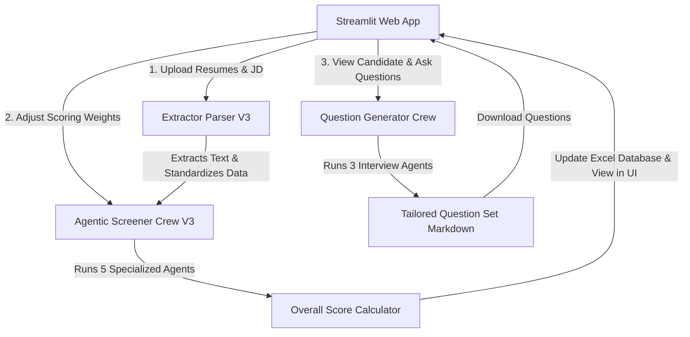

# 🔍 HireLens: Multi-Agent AI Candidate Screening & Interview Preparation System

HireLens is a multi-agent AI system that automates candidate resume screening and generates tailor-made interview questions. Built on **CrewAI** and **Azure OpenAI (GPT-4o-mini)**, HireLens parses resumes, evaluates candidate profiles across four dimensions, visualises scoring analytics, and drafts custom technical and case-study questions matched to the candidate's experience and the target Job Description (JD).

---

## 🚀 Key Features

*   **Multi-Resume & Job Description Upload**: PDF parser that extracts text from resumes (`pypdf`) and job descriptions (`pdfplumber`).
*   **Dynamic Scoring Weights**: Adjust the importance of four evaluation categories via interactive sliders:
    *   **Technical Skills Weight**
    *   **Experience Weight**
    *   **Education Weight**
    *   **Industry Relevance Weight**
*   **Multi-Agent Screening Crew**: A CrewAI sequential pipeline of 5 specialised agents:
    *   **Technical Skills Assessor** — maps candidate skills against the JD, identifying matches, gaps, and bonus skills.
    *   **Work Experience Evaluator** — evaluates years of experience, depth of roles, and career progression.
    *   **Education Qualification Assessor** — analyses academic background, specialisations, and certifications.
    *   **Industry Fit Evaluator** — rates familiarity with industry standards, terminology, and domain practices.
    *   **Senior Resume Analyst** — synthesises the assessments, compiles strengths, flags concerns, determines the match category, and writes a justification.
*   **Interactive Analytics Dashboard** (Streamlit + Plotly):
    *   KPIs: Total Resumes, Top 10% Score, Average Score, Median Score.
    *   Score Distribution Histogram and Match Category Pie Chart.
    *   A colour-graded results table.
    *   Export screening results to Excel.
*   **Custom Interview Question Generator Crew**: A 3-agent crew producing 6 technical + 2 case-study questions mapped to the candidate's profile and the JD:
    *   **Case Study Researcher** — designs a realistic case study with objectives and constraints.
    *   **Technical Question Designer** — designs 5-8 targeted technical questions with expected answers and follow-ups.
    *   **Interview Question Reviewer** — refines, proofreads, and formats the final set for immediate use.
*   **Interactive Candidate Management**: Review resumes in-app, approve or reject candidates, and download question sets as Markdown.

---

## 🛠️ Project Architecture



---

## 📂 Project Structure

```text
├── Assets/
│   ├── images/
│   │   └── cognitio_logo.png            # Cognitio branding image
│   └── logo.png                         # HireLens primary application logo
├── scripts/
│   ├── config/
│   │   ├── agent.yaml                   # Config placeholder for agent definitions
│   │   └── task.yaml                    # Config placeholder for task definitions
│   ├── agentic_screener.ipynb           # Notebook for testing screener logic
│   ├── agentic_screener_function_v3.py  # CrewAI multi-agent screening system
│   ├── extractor_parser_v3.py           # PDF text extractor and resume standardiser
│   └── question_generator.py            # CrewAI interview question generator
├── Temp_Uploads/                        # Scratch space for the current upload batch
├── resume_folder_path/                  # Archive of processed resume batches (auto-created)
├── resume_score/
│   └── resume_result.xlsx               # Candidate scores and recommendations
├── .env.example                         # Template for credentials — copy to .env
├── config.txt                           # Local folder paths (no secrets)
├── HireLens_webapp.py                   # Main Streamlit web application
├── requirements.txt                     # Python package dependencies
└── README.md                            # Documentation (this file)
```

---

## ⚙️ Configuration & Setup

### 1. Credentials (`.env`)

All API credentials live in a `.env` file at the project root. Copy the template and fill it in:

```bash
cp .env.example .env      # Windows: copy .env.example .env
```

```env
AZURE_API_KEY=your-azure-openai-key
AZURE_API_BASE=https://your-resource-name.openai.azure.com/
AZURE_API_VERSION=2024-12-01-preview
AZURE_DEPLOYMENT_NAME=gpt-4o-mini
CREWAI_LLM_MODEL=azure/gpt-4o-mini
```

`.env` is listed in `.gitignore` — **never commit it**. Credentials are loaded via `python-dotenv` and the client is built lazily, so a missing key produces a clear error message rather than a crash at import time.

### 2. File paths (`config.txt`)

`config.txt` holds only folder locations, no secrets. Paths may be **relative to the project root** (recommended, works on any machine) or absolute:

```ini
[Folder]
base_path = resume_folder_path
resume_score_df = resume_score/resume_result.xlsx
```

Both directories are created automatically on first run.

---

## 🏃 Getting Started

### Prerequisites

*   Python 3.10 – 3.12
*   An active Azure OpenAI service instance with a `gpt-4o-mini` deployment

### Installation

1. Navigate to the project folder:
   ```bash
   cd path/to/HireLens
   ```

2. (Recommended) create a virtual environment:
   ```bash
   python -m venv .venv
   # Windows
   .venv\Scripts\activate
   # macOS / Linux
   source .venv/bin/activate
   ```

3. Install dependencies:
   ```bash
   pip install -r requirements.txt
   ```

4. Create your `.env` file (see above).

5. Run the app:
   ```bash
   streamlit run HireLens_webapp.py
   ```

6. Open the local address Streamlit prints (usually `http://localhost:8501`).

---

## 📖 Usage

1. Upload one or more resume PDFs and a single job description PDF.
2. Set the four scoring weights so they total **100**.
3. Click **🚀 Process Documents**. Each resume is parsed, then scored by the 5-agent crew.
4. Review the KPIs, charts, and results table. Download the results as Excel.
5. In **Top Candidates**, click **View** on a candidate to open the resume viewer.
6. Click **🧠 Create Question Set** to generate a tailored interview sheet, then download it as Markdown.
7. Approve or reject candidates — the status is written back to `resume_result.xlsx`.

> **Cost note:** every resume triggers 5 sequential LLM calls, and every question set triggers 3 more. A 20-resume batch is ~100 calls.

---

## 👥 Multi-Agent Details

### 1. Screening Crew

| Agent | Responsibility |
| --- | --- |
| Technical Skills Assessor | Grades the technical match against JD keywords and requirements |
| Work Experience Evaluator | Judges experience relevance, achievements, and progression |
| Education Qualification Assessor | Assesses degrees, specialisations, and certifications |
| Industry Fit Evaluator | Judges domain expertise and industry knowledge |
| Senior Resume Analyst | Compiles a structured JSON evaluation: strengths, concerns, match category, justification, recommendation |

Each of the four category scores is 0–100. `Overall_Score` is their weighted average using the slider weights (weights are normalised to sum to 1 internally, so a slight mismatch degrades gracefully).

### 2. Interview Question Crew

| Agent | Responsibility |
| --- | --- |
| Case Study Researcher | Creates elaborated, role-relevant case study scenarios |
| Technical Question Designer | Designs focused technical questions probing the candidate's claims |
| Interview Question Reviewer | Proofreads and formats the final ready-to-use interview sheet |

---

## 🧰 Troubleshooting

| Symptom | Cause / Fix |
| --- | --- |
| `Missing Azure OpenAI credentials: ...` | `.env` is absent or incomplete. Copy `.env.example` to `.env` and fill it in. |
| `No PDF files found in ...` | The upload batch didn't reach the archive folder. Check `base_path` in `config.txt` is writable. |
| `Skipping <file>: no extractable text` | The PDF is a scanned image with no text layer. Run it through OCR first. |
| Results table shows no colour gradient | `matplotlib` isn't installed — `pip install -r requirements.txt`. |
| Resume preview is a blank box | Some browsers block base64 PDF iframes. Use the **Open / download this resume** button below the preview. |
| `PermissionError` writing `resume_result.xlsx` | The workbook is open in Excel. Close it and retry. |
| Rate-limit / timeout errors during screening | Azure throughput limit. Reduce batch size or raise your deployment quota. |

---

## 🔒 Security

*   Secrets belong in `.env` only. `config.txt` is committed and must stay credential-free.
*   If a key was ever committed, **rotate it** — it remains recoverable in git history even after being removed from the working tree.
*   Uploaded resumes contain personal data. `Temp_Uploads/` and `resume_folder_path/` are git-ignored; clear them periodically in line with your data-retention policy.
